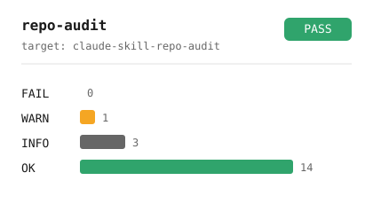

# repo-audit

You are about to make a repository public. A leaked API key or an old work
email address baked into the git history is unrecoverable the moment you
push — GitHub caches history, forks copy it, and search engines index it.
`repo-audit` is a publish gate that catches that class of mistake
deterministically, before it ever leaves your machine: secret and API-key
scanning, an author-identity and internal-term sweep across the *whole* git
history (not just the working tree), test execution, a check that your
declared language actually matches what you committed, README image rot,
staleness, and GitHub description/topic quality. It also runs over a whole
list of repositories in parallel and renders a portfolio dashboard.

<picture>
  <source media="(prefers-color-scheme: dark)" srcset="docs/demo-dark.svg">
  
</picture>

## Install

Clone it anywhere and link the folder into each agent's skills directory
(Claude Code, Codex, agy or Cursor); see `SETUP.md`.

```bash
git clone <this-repo-url> <skill-dir>
cd <skill-dir>
uv sync
```

## Quick start

```bash
# Audit one repository
uv run python scripts/audit.py /path/to/repo --profile portfolio --json-out report.json

# Audit a whole portfolio in parallel
uv run python scripts/scan.py --repos repos.txt --profile portfolio --out dashboard.json

# Render either as an English markdown report
uv run python scripts/dashboard.py --json dashboard.json --format md
```

Every run prints `JSON_PATH=<path>` as the last line of stdout — that's the
machine-readable report (schema v2, see `docs/json_contract.md`); everything
else goes to stderr.

## What it checks

| Check id | Severity | What it catches |
|---|---|---|
| `secrets.pattern` | FAIL | AWS/GitHub/Slack/Google/Anthropic/OpenAI/Stripe keys, private-key headers, JWTs, generic `key="..."` assignments |
| `secrets.entropy` | WARN | high-entropy strings that look like an unrecognized secret |
| `secrets.committed_env` | FAIL | a tracked `.env`, now or ever in history |
| `secrets.env_not_ignored` | FAIL | `.env` on disk not yet covered by `.gitignore` |
| `history.author_identity` | FAIL | a commit author/committer that isn't your portfolio identity, a GitHub noreply address, or a known public provider |
| `history.commit_message` / `history.ref_name` | FAIL / WARN | a configured denylisted term in a commit message or ref name |
| `content.denylist_term` | FAIL | a configured denylisted term in tracked file content |
| `tests.execution` | OK / FAIL / WARN / INFO | the repo's own test suite, actually run, only with `--trust-target` (it executes the target's code) |
| `language.declared_vs_real` | FAIL / WARN | the declared stack (`pyproject.toml`, `package.json`, ...) not matching the real byte histogram |
| `readme.broken_relative_image` / `readme.hotlinked_image` | FAIL / WARN | a dead screenshot link, or one that will rot because it hotlinks another site |
| `staleness.last_commit` | WARN / FAIL | a repo that has not been touched in a long time |
| `github.description` / `github.topics` | WARN | a missing or low-quality GitHub description/topic set |
| `deferred_work.marker` | WARN / INFO | a `ROADMAP.md`/`TODO.md`/inline `TODO:` that says the work isn't finished |

The full list, with the exact rule and remediation for each check id, is in
`docs/rules.md`.

## Profiles

| Profile | Intent | Notable difference |
|---|---|---|
| `portfolio` | About to publish under a personal account | `deferred_work.marker` is `WARN`; test execution defaults to on |
| `public` | Already public, periodic re-check | Same checks as `portfolio`; `deferred_work.marker` downgraded to `INFO` |
| `local` | Fast local iteration | Every `WARN` downgraded to `INFO`; GitHub metadata checks downgraded to `INFO` |

## Configuration

Generic, committed config lives in `repo-audit.toml` at the audited repo's
root. Real employer names or internal ticket prefixes never belong in a
committed file — they go in a gitignored `repo-audit.local.toml`, mirroring
the `.env`/`.env.example` pattern. See `SETUP.md` for the full precedence
chain and the local-secrets pattern.

## Structure

```
scripts/
  audit.py            single-repo CLI
  scan.py             multi-repo CLI (parallel)
  dashboard.py        dashboard renderer
  make_fixture.py     materializes clean/dirty git fixtures for tests
  render_demo.py      JSON report -> docs/demo-{light,dark}.svg
  auditlib/           shared engine: severity, config, registry, runner, report
    checks/           generic checks (true of any repository)
    prompts/          generic layer-2 prompts
  checks/             repo-audit-only checks (secrets, git history, ...)
  prompts/            repo-audit-only layer-2 prompt
profiles/             portfolio / public / local profile definitions
config/               shipped structural denylist defaults
examples/clean_repo/  a real, independently-passing example repo
docs/                 check reference, JSON contract, prompt index, demo assets
tests/                pytest suite, including a self-audit ("dogfood") test
```

## License

[MIT](LICENSE)
