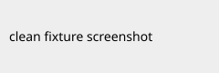

# Clean Fixture

A minimal example repository used by repo-audit's own test suite to exercise
the "everything is in order" path: a resolvable screenshot, a declared
toolchain, and a passing test suite.



## Quick start

```bash
pip install -e .
pytest -q
```
